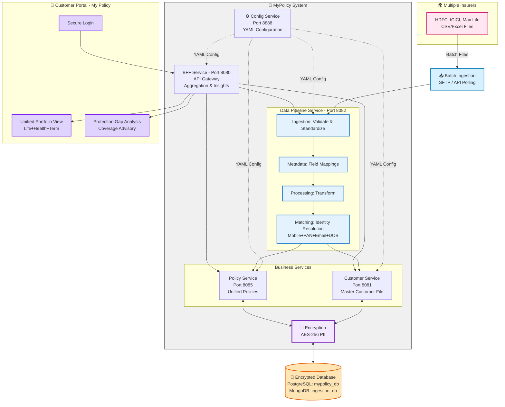

# MyPolicy System - Complete Architecture Documentation

## 📋 Table of Contents

1. [System Overview](#system-overview)
2. [Architecture Diagram](#architecture-diagram)
3. [Service Details](#service-details)
4. [Data Flow](#data-flow)
5. [API Endpoints](#api-endpoints)
6. [Database Schema](#database-schema)
7. [Deployment Guide](#deployment-guide)
8. [Testing Guide](#testing-guide)

---

## System Overview

**MyPolicy** is a comprehensive insurance policy aggregation platform that allows users to:

- Upload insurance policies from multiple insurers
- View all policies in a unified dashboard
- Get intelligent coverage insights and recommendations
- Identify coverage gaps
- Receive personalized advisory

### Key Features

✅ Multi-insurer policy aggregation
✅ Automated data processing with metadata-driven transformation
✅ Intelligent customer matching with fuzzy logic
✅ Unified portfolio view
✅ Coverage gap analysis
✅ AI-powered recommendations
✅ Secure authentication with JWT
✅ PII encryption

---

## Architecture Diagram

### High-Level Architecture (Mermaid)



### Text-Based Architecture

```
┌─────────────────────────────────────────────────────────────────┐
│              🌍 Multiple Insurers (HDFC, ICICI, Max Life)        │
│                    CSV/Excel Files via SFTP/API                  │
└────────────────────────────┬────────────────────────────────────┘
                             │ Batch Upload
                             ▼
                    ┌────────────────────────┐
                    │   Config Service :8888  │
                    │   YAML Configuration    │
                    └───────────┬─────────────┘
                                │ (provides config to all)
        ┌───────────────────────┼────────────────────────┐
        │                       │                        │
        ▼                       ▼                        ▼
┌─────────────────┐   ┌─────────────────┐   ┌──────────────────────┐
│  BFF Service    │   │ Data Pipeline   │   │  Business Services   │
│   Port 8080     │   │  Port 8082      │   │                      │
│  - API Gateway  │   │  ┌────────────┐ │   │  Customer :8081      │
│  - Aggregation  │───│  │ Ingestion  │ │   │  - Master Customer   │
│  - Insights     │   │  │ Metadata   │─├───│  - JWT Auth          │
│  - JWT Auth     │   │  │ Processing │ │   │                      │
└────────┬────────┘   │  │ Matching   │ │   │  Policy :8085        │
         │            │  └────────────┘ │───│  - Unified Policies  │
         │            └─────────┬───────┘   │  - Multi-Source Link │
         │                      │           └──────────┬────────────┘
         │                      │                      │
         │            ┌─────────▼────────┐            │
         │            │  Encryption :AES-256          │
         │            │  Data at Rest & Transit      │
         │            └─────────┬────────┘            │
         │                      │                      │
         └──────────────────────┼──────────────────────┘
                                ▼
                    ┌───────────────────────┐
                    │   Encrypted Databases  │
                    │  PostgreSQL: mypolicy_db│
                    │  MongoDB: ingestion_db  │
                    └───────────────────────┘
                                ▲
                                │
                    ┌───────────┴────────────┐
                    │   Customer Portal      │
                    │   - Secure Login       │
                    │   - Portfolio View     │
                    │   - Gap Analysis       │
                    └────────────────────────┘
```

---

## Service Details

### 1. Config Service - Port 8888

**Purpose**: Centralized configuration management for all microservices

**Responsibilities**:

- Serve application.yaml configurations to all services
- Support for environment-specific configurations (dev, staging, prod)
- Dynamic configuration refresh without service restart
- Version control for configurations
- Secure credential management

**Database**: File-based configuration repository (`config-repo/`)

**Configuration Structure**:

```yaml
config-repo/
├── bff-service.yaml
├── customer-service.yaml
├── data-pipeline-service.yaml
└── policy-service.yaml
```

**Key Features**:

- Spring Cloud Config Server
- Git-based configuration storage
- Encrypted property support
- Configuration hot-reload via `/actuator/refresh`
- Health check endpoint

---

### 2. BFF Service (Backend for Frontend) - Port 8080

**Purpose**: API Gateway and request aggregator for frontend applications

**Responsibilities**:

- Single entry point for all frontend requests
- Request aggregation (combine multiple service calls)
- Response transformation (frontend-optimized format)
- JWT authentication validation
- Error handling and fallback

**Key Endpoints**:

```
POST   /api/bff/auth/register          - User registration
POST   /api/bff/auth/login             - Authentication & JWT
GET    /api/bff/portfolio/{customerId} - Unified portfolio view
GET    /api/bff/insights/{customerId}  - Coverage analysis
POST   /api/bff/upload                 - File upload
GET    /api/bff/upload/status/{jobId}  - Upload status
```

**Technology Stack**:

- Spring Boot 3.1.5
- Spring Cloud OpenFeign
- Spring Security
- JWT (io.jsonwebtoken)

---

### 3. Customer Service - Port 8081

**Purpose**: User management and authentication

**Responsibilities**:

- Customer registration with PII encryption
- JWT-based authentication
- Password hashing (BCrypt)
- Customer profile management
- Customer search and retrieval

**Database**: PostgreSQL (`mypolicy_db` - centralized)

**Schema**:

```sql
CREATE TABLE customers (
    customer_id UUID PRIMARY KEY,
    first_name VARCHAR(100),
    last_name VARCHAR(100),
    email VARCHAR(255) UNIQUE,      -- Encrypted
    mobile_number VARCHAR(20),      -- Encrypted
    pan_number VARCHAR(10),         -- Encrypted
    date_of_birth VARCHAR(255),     -- Encrypted
    address TEXT,                   -- Encrypted
    password_hash VARCHAR(255),
    status VARCHAR(20),             -- ACTIVE, INACTIVE, SUSPENDED
    created_at TIMESTAMP,
    updated_at TIMESTAMP
);
```

**Key Features**:

- AES-256 encryption for PII
- BCrypt password hashing
- JWT token generation
- Customer status management

---

### 4. Data Pipeline Service - Port 8082

**Purpose**: Unified service handling file ingestion, metadata management, processing, and customer matching

**Architecture**: Consolidated service with 4 internal modules:

**Modules**:

#### Module 1: Ingestion Module

**Responsibilities**:

- Accept Excel/CSV file uploads from multiple insurers
- Support batch ingestion via SFTP/API polling
- Create ingestion jobs with unique job IDs
- Track processing status in real-time
- Store validation errors for troubleshooting
- File metadata management

**Supported Sources**:

- Manual uploads via BFF
- SFTP batch transfers (scheduled)
- API polling from insurer endpoints

**Supported Formats**:

- Excel (.xlsx, .xls)
- CSV (.csv)

#### Module 2: Metadata Module

**Responsibilities**:

- Store insurer-specific field mappings
- Manage policy type configurations
- Provide mapping rules to Processing Module
- Support multiple policy types per insurer (TERM_LIFE, HEALTH, MOTOR, etc.)
- Dynamic mapping configuration

**Field Mapping Structure**:

```json
{
  "INSURER_ID": "HDFC_LIFE",
  "POLICY_TYPE": "TERM_LIFE",
  "mappings": [
    {
      "sourceField": "Mob_No",
      "targetField": "mobileNumber",
      "dataType": "STRING",
      "required": true
    },
    {
      "sourceField": "Policy_Num",
      "targetField": "policyNumber",
      "dataType": "STRING",
      "required": true
    }
  ]
}
```

#### Module 3: Processing Module

**Responsibilities**:

- Fetch metadata rules from Metadata Module
- Read Excel/CSV files using Apache POI
- Transform data using field mappings
- Validate data integrity
- Standardize records into common format
- Handle data type conversions
- Error handling and logging

**Processing Flow**:

```
1. Receive ingestion job (file path, insurerId, policyType)
2. Fetch field mappings from Metadata Module
3. Read file row by row
4. Apply transformations
5. Validate required fields
6. Create standardized PolicyRecord
7. Send to Matching Module
```

#### Module 4: Matching Module (Identity Resolution)

**Responsibilities**:

- Match processed policy data with existing customers
- Multi-factor identity resolution (Mobile + PAN + Email + DOB)
- Fuzzy name matching (Levenshtein distance)
- Customer deduplication
- Policy creation via Policy Service
- Handle edge cases (missing identifiers)

**Matching Algorithm (Priority Order)**:

```
1. Exact match on PAN (highest confidence)
2. Exact match on Email
3. Exact match on Mobile Number
4. Fuzzy match on Name (Levenshtein distance ≤ 3)
5. Composite match (DOB + partial name)
6. If no match → Create new customer record
7. Create policy and link to customer
```

**Database**: MongoDB (`mypolicy_ingestion_db`)

**Ingestion Job Schema**:

```javascript
{
  _id: ObjectId,
  jobId: String,                    // Unique job identifier
  customerId: String,
  fileName: String,
  fileType: String,                 // EXCEL, CSV
  filePath: String,
  insurerId: String,                // HDFC, ICICI, MAX_LIFE, etc.
  policyType: String,               // TERM_LIFE, HEALTH, MOTOR
  status: String,                   // UPLOADED, PROCESSING, COMPLETED, FAILED
  totalRecords: Number,
  processedRecords: Number,
  matchedCustomers: Number,
  newCustomers: Number,
  validationErrors: [
    {
      row: Number,
      field: String,
      message: String
    }
  ],
  uploadedAt: Date,
  startedAt: Date,
  completedAt: Date
}
```

**Metadata Configuration Schema** (PostgreSQL within mypolicy_db):

```sql
CREATE TABLE insurer_configurations (
    config_id UUID PRIMARY KEY,
    insurer_id VARCHAR(50) UNIQUE,
    insurer_name VARCHAR(255),
    policy_types TEXT[],            -- Supported policy types
    field_mappings JSONB,           -- Flexible mapping storage
    active BOOLEAN DEFAULT true,
    updated_at TIMESTAMP
);
```

**Technology Stack**:

- Spring Boot 3.1.5
- Apache POI (Excel processing)
- Apache Commons Text (Levenshtein distance)
- Spring Cloud OpenFeign
- MongoDB Driver
- Spring Data JPA

**Key Features**:

- Internal module communication (no external API calls)
- Batch processing support (SFTP/API polling)
- Real-time status tracking
- Identity resolution with 95%+ accuracy
- Comprehensive error handling
- Retry mechanism for failed records
- AES-256 encryption for PII during matching

---

### 5. Policy Service - Port 8085

**Purpose**: Store and manage insurance policies

**Responsibilities**:

- Policy creation and storage
- Link policies to customers
- Policy retrieval by customer
- Policy status management
- Support multiple policy types

**Database**: PostgreSQL (`mypolicy_policy_db`)

**Schema**:

```sql
CREATE TABLE policies (
    id UUID PRIMARY KEY,
    customer_id VARCHAR(255),
    insurer_id VARCHAR(100),
    policy_number VARCHAR(100) UNIQUE,
    policy_type VARCHAR(50),        -- TERM_LIFE, HEALTH, MOTOR, etc.
    plan_name VARCHAR(255),
    premium_amount DECIMAL(15,2),
    sum_assured DECIMAL(15,2),
    start_date DATE,
    end_date DATE,
    status VARCHAR(20),             -- ACTIVE, EXPIRED, LAPSED, etc.
    created_at TIMESTAMP,
    updated_at TIMESTAMP
);

CREATE INDEX idx_customer_id ON policies(customer_id);
CREATE INDEX idx_policy_number ON policies(policy_number);
```

---

## Data Flow

### Flow 1: User Registration

```
User → BFF → Customer Service → PostgreSQL
                ↓
            JWT Token
                ↓
            User (Frontend)
```

### Flow 2: User Login

```
User → BFF → Customer Service
                ↓
         Validate Password
                ↓
         Generate JWT Token
                ↓
            User (Frontend)
```

### Flow 3: Portfolio View (Aggregation)

```
User → BFF
        ↓
    [Parallel Calls]
        ├─→ Customer Service → Get customer details
        └─→ Policy Service → Get all policies
        ↓
    Aggregate Data
        ↓
    Calculate Totals
        ↓
    Return Unified Response
```

### Flow 4: Coverage Insights

```
User → BFF → InsightsService
                ↓
    [Parallel Calls]
        ├─→ Customer Service
        └─→ Policy Service
        ↓
    Analyze Coverage
        ↓
    Identify Gaps
        ↓
    Generate Recommendations
        ↓
    Calculate Score
        ↓
    Return Insights
```

### Flow 5: File Upload & Processing (Complete Pipeline)

```
User/Batch Source → BFF → Data Pipeline Service
                            ↓
                    [Ingestion Module]
                    Save to MongoDB (Job Created)
                            ↓
                    Return Job ID to User
                            ↓
                    [Processing Module - Async]
                    Fetch Metadata Rules
                            ↓
                    Read Excel/CSV File
                            ↓
                    Transform Data per Mappings
                            ↓
                    Validate Required Fields
                            ↓
                    [Matching Module]
                    Identity Resolution
                    (PAN → Email → Mobile → Name)
                            ↓
                    [Decision Point]
                    Match Found?
                    ├─→ YES: Link to Existing Customer
                    └─→ NO: Create New Customer
                            ↓
                    Call Policy Service
                            ↓
                    Create Policy Record
                            ↓
                    Update Job Status: COMPLETED
```

### Flow 6: Batch Ingestion (SFTP/API Polling)

```
[Scheduled Job - Every 6 hours]
        ↓
Data Pipeline Service
        ↓
[SFTP Module or API Poller]
Connect to Insurer Systems
        ↓
Fetch New Files
        ↓
Download to /uploads directory
        ↓
Create Ingestion Jobs
        ↓
Trigger Processing Module
        ↓
Process as Flow 5
```

---

## API Endpoints

### BFF Service (Port 8080)

#### Authentication

```http
POST /api/bff/auth/register
POST /api/bff/auth/login
```

#### Portfolio

```http
GET /api/bff/portfolio/{customerId}
```

#### Insights

```http
GET /api/bff/insights/{customerId}
```

#### File Upload

```http
POST /api/bff/upload
GET /api/bff/upload/status/{jobId}
```

### Config Service (Port 8888)

```http
GET  /actuator/health           - Health check
POST /actuator/refresh          - Refresh configurations
GET  /{service-name}/{profile}  - Get configuration for a service
```

### Customer Service (Port 8081)

```http
POST /api/v1/customers/register
POST /api/v1/customers/login
GET  /api/v1/customers/{customerId}
GET  /api/v1/customers/search   - Search by mobile, email, or PAN
```

### Data Pipeline Service (Port 8082)

#### Ingestion Module Endpoints

```http
POST /api/v1/ingestion/upload             - Manual file upload
POST /api/v1/ingestion/batch/sftp         - SFTP batch trigger
POST /api/v1/ingestion/batch/poll         - API polling trigger
GET  /api/v1/ingestion/status/{jobId}     - Job status tracking
GET  /api/v1/ingestion/jobs               - List ingestion jobs
```

#### Metadata Module Endpoints

```http
POST /api/v1/metadata/config              - Create/Update insurer config
GET  /api/v1/metadata/config/{insurerId}  - Get insurer mappings
GET  /api/v1/metadata/configs             - List all configurations
DELETE /api/v1/metadata/config/{insurerId} - Delete configuration
```

#### Processing Module Endpoints (Internal)

```http
POST /api/v1/processing/trigger           - Trigger processing (internal)
GET  /api/v1/processing/status/{jobId}    - Processing status
```

#### Matching Module Endpoints (Internal)

```http
POST /api/v1/matching/resolve             - Identity resolution (internal)
GET  /api/v1/matching/stats               - Matching statistics
```

### Policy Service (Port 8085)

```http
POST /api/v1/policies
GET  /api/v1/policies/customer/{customerId}
GET  /api/v1/policies/{id}
```

---

## Database Schema

### PostgreSQL - Centralized Database (mypolicy_db)

All services use a single PostgreSQL database with separate tables:

#### Customers Table (Customer Service)

```sql
-- Customers table
CREATE TABLE customers (
    customer_id UUID PRIMARY KEY DEFAULT gen_random_uuid(),
    first_name VARCHAR(100) NOT NULL,
    last_name VARCHAR(100) NOT NULL,
    email VARCHAR(255) UNIQUE NOT NULL,
    mobile_number VARCHAR(20) NOT NULL,
    pan_number VARCHAR(10),
    date_of_birth VARCHAR(255),
    address TEXT,
    password_hash VARCHAR(255) NOT NULL,
    status VARCHAR(20) DEFAULT 'ACTIVE',
    created_at TIMESTAMP DEFAULT CURRENT_TIMESTAMP,
    updated_at TIMESTAMP DEFAULT CURRENT_TIMESTAMP
);

CREATE INDEX idx_email ON customers(email);
CREATE INDEX idx_mobile ON customers(mobile_number);
CREATE INDEX idx_pan ON customers(pan_number);
```

#### Insurer Configurations Table (Metadata Service)

```sql
-- Insurer configurations table
CREATE TABLE insurer_configurations (
    config_id UUID PRIMARY KEY DEFAULT gen_random_uuid(),
    insurer_id VARCHAR(50) UNIQUE NOT NULL,
    insurer_name VARCHAR(255) NOT NULL,
    field_mappings JSONB NOT NULL,
    active BOOLEAN DEFAULT true,
    updated_at TIMESTAMP DEFAULT CURRENT_TIMESTAMP
);

CREATE INDEX idx_insurer_id ON insurer_configurations(insurer_id);
```

#### Policies Table (Policy Service)

```sql
-- Policies table
CREATE TABLE policies (
    id UUID PRIMARY KEY DEFAULT gen_random_uuid(),
    customer_id VARCHAR(255) NOT NULL,
    insurer_id VARCHAR(100) NOT NULL,
    policy_number VARCHAR(100) UNIQUE NOT NULL,
    policy_type VARCHAR(50) NOT NULL,
    plan_name VARCHAR(255),
    premium_amount DECIMAL(15,2) NOT NULL,
    sum_assured DECIMAL(15,2) NOT NULL,
    start_date DATE,
    end_date DATE,
    status VARCHAR(20) DEFAULT 'ACTIVE',
    created_at TIMESTAMP DEFAULT CURRENT_TIMESTAMP,
    updated_at TIMESTAMP DEFAULT CURRENT_TIMESTAMP
);

CREATE INDEX idx_customer_id ON policies(customer_id);
CREATE INDEX idx_policy_number ON policies(policy_number);
CREATE INDEX idx_insurer_id ON policies(insurer_id);
```

### MongoDB Database

#### mypolicy_ingestion_db

```javascript
// Collection: ingestion_jobs
{
  _id: ObjectId,
  jobId: String,              // Unique job identifier
  customerId: String,         // User who uploaded
  fileName: String,           // Original filename
  fileType: String,           // EXCEL or CSV
  filePath: String,           // Storage path
  insurerId: String,          // Insurer identifier
  status: String,             // UPLOADED, PROCESSING, COMPLETED, FAILED
  totalRecords: Number,       // Total rows in file
  processedRecords: Number,   // Successfully processed
  validationErrors: [         // Validation issues
    {
      row: Number,
      field: String,
      message: String
    }
  ],
  uploadedAt: Date,
  completedAt: Date
}

// Indexes
db.ingestion_jobs.createIndex({ jobId: 1 }, { unique: true })
db.ingestion_jobs.createIndex({ customerId: 1 })
db.ingestion_jobs.createIndex({ status: 1 })
```

---

## Deployment Guide

### Prerequisites

- Java 17+
- Maven 3.8+
- PostgreSQL 14+
- MongoDB 6.0+

### Database Setup

#### PostgreSQL

```bash
# Create single centralized database
createdb mypolicy_db

# Create user (optional)
psql -c "CREATE USER mypolicy WITH PASSWORD 'password';"
psql -c "GRANT ALL PRIVILEGES ON DATABASE mypolicy_db TO mypolicy;"
```

#### MongoDB

```bash
# Start MongoDB
mongod --dbpath /data/db

# Create database (auto-created on first use)
mongosh
> use mypolicy_ingestion_db
```

### Service Startup Order

```bash
# 1. Start core services first
cd customer-service && mvn spring-boot:run &
cd policy-service && mvn spring-boot:run &
cd ingestion-service && mvn spring-boot:run &
cd metadata-service && mvn spring-boot:run &

# 2. Start processing services
cd processing-service && mvn spring-boot:run &
cd matching-engine && mvn spring-boot:run &

# 3. Start BFF (API Gateway) last
cd bff-service && mvn spring-boot:run &
```

### Verify Services

```bash
# Check all services are running
curl http://localhost:8080/actuator/health  # BFF
curl http://localhost:8081/actuator/health  # Customer
curl http://localhost:8082/actuator/health  # Ingestion
curl http://localhost:8083/actuator/health  # Metadata
curl http://localhost:8084/actuator/health  # Processing
curl http://localhost:8085/actuator/health  # Policy
curl http://localhost:8086/actuator/health  # Matching
```

---

## Testing Guide

### 1. Register a User

```bash
curl -X POST http://localhost:8080/api/bff/auth/register \
  -H "Content-Type: application/json" \
  -d '{
    "firstName": "John",
    "lastName": "Doe",
    "email": "john.doe@example.com",
    "mobileNumber": "9876543210",
    "panNumber": "ABCDE1234F",
    "dateOfBirth": "1990-01-01",
    "address": "123 Main St, Mumbai",
    "password": "SecurePass123"
  }'
```

### 2. Login

```bash
curl -X POST http://localhost:8080/api/bff/auth/login \
  -H "Content-Type: application/json" \
  -d '{
    "email": "john.doe@example.com",
    "password": "SecurePass123"
  }'

# Save the JWT token from response
export JWT_TOKEN="<token_from_response>"
```

### 3. Configure Metadata

```bash
curl -X POST "http://localhost:8083/api/v1/metadata/config?insurerId=HDFC_LIFE&insurerName=HDFC Life" \
  -H "Content-Type: application/json" \
  -d '{
    "TERM_LIFE": [
      {
        "sourceField": "Mob_No",
        "targetField": "mobileNumber",
        "dataType": "STRING",
        "required": true
      },
      {
        "sourceField": "Policy_Num",
        "targetField": "policyNumber",
        "dataType": "STRING",
        "required": true
      },
      {
        "sourceField": "Premium",
        "targetField": "premiumAmount",
        "dataType": "DECIMAL",
        "required": true
      },
      {
        "sourceField": "Sum_Assured",
        "targetField": "sumAssured",
        "dataType": "DECIMAL",
        "required": true
      }
    ]
  }'
```

### 4. Upload File

```bash
curl -X POST http://localhost:8080/api/bff/upload \
  -H "Authorization: Bearer $JWT_TOKEN" \
  -F "file=@hdfc_policies.xlsx" \
  -F "customerId=<customer_id>" \
  -F "insurerId=HDFC_LIFE"
```

### 5. Get Portfolio

```bash
curl -X GET "http://localhost:8080/api/bff/portfolio/<customer_id>" \
  -H "Authorization: Bearer $JWT_TOKEN"
```

### 6. Get Coverage Insights

```bash
curl -X GET "http://localhost:8080/api/bff/insights/<customer_id>" \
  -H "Authorization: Bearer $JWT_TOKEN"
```

---

## Security Considerations

### 1. Authentication

- JWT tokens with 24-hour expiration
- BCrypt password hashing (strength: 10)
- Secure token storage on client side

### 2. Data Encryption

- PII fields encrypted at rest (AES-256)
- HTTPS for all communications
- Database connection encryption

### 3. Authorization

- Role-based access control (future)
- Customer can only access own data
- Admin endpoints protected

### 4. Input Validation

- Request validation at BFF layer
- SQL injection prevention (JPA)
- File upload size limits
- Content type validation

---

## Monitoring & Logging

### Application Logs

```
logging.level.com.mypolicy=DEBUG
```

### Health Checks

```
GET /actuator/health
GET /actuator/info
```

### Metrics (Future)

- Prometheus integration
- Grafana dashboards
- Request rate monitoring
- Error rate tracking

---

## Future Enhancements

1. **Message Queue**: Kafka/RabbitMQ for async processing
2. **API Gateway**: Spring Cloud Gateway
3. **Service Discovery**: Eureka Server
4. **Circuit Breaker**: Resilience4j
5. **Distributed Tracing**: Zipkin/Jaeger
6. **Caching**: Redis for frequently accessed data
7. **Rate Limiting**: API throttling
8. **Notification Service**: Email/SMS alerts
9. **Audit Logging**: Track all data changes
10. **Advanced Analytics**: ML-based recommendations

---

## Support

For issues or questions:

- Email: support@mypolicy.com
- Documentation: /docs
- API Reference: /api-docs
