# Complete MyPolicy API Sequence Diagram - All Services Connected

## Master Sequence Diagram - Complete System Flow

This diagram shows the complete end-to-end flow with all 7 microservices interacting.

```mermaid
sequenceDiagram
    participant User as User/Frontend
    participant BFF as BFF Service<br/>(Port 8080)
    participant Customer as Customer Service<br/>(Port 8081)
    participant Ingestion as Ingestion Service<br/>(Port 8082)
    participant Metadata as Metadata Service<br/>(Port 8083)
    participant Processing as Processing Service<br/>(Port 8084)
    participant Policy as Policy Service<br/>(Port 8085)
    participant Matching as Matching Engine<br/>(Port 8086)
    participant CustDB as PostgreSQL<br/>(customer_db)
    participant MetaDB as PostgreSQL<br/>(metadata_db)
    participant PolDB as PostgreSQL<br/>(policy_db)
    participant MongoDB as MongoDB<br/>(ingestion_db)

    rect rgb(200, 220, 240)
        Note over User,CustDB: PHASE 1: User Registration & Authentication
        
        User->>BFF: POST /api/bff/auth/register<br/>{firstName, lastName, email, password}
        activate BFF
        BFF->>Customer: POST /api/v1/customers/register
        activate Customer
        Customer->>Customer: Hash password (BCrypt)<br/>Encrypt PII (AES-256)
        Customer->>CustDB: INSERT INTO customers
        activate CustDB
        CustDB-->>Customer: customerId
        deactivate CustDB
        Customer-->>BFF: CustomerResponse
        deactivate Customer
        BFF-->>User: 201 Created
        deactivate BFF
        
        User->>BFF: POST /api/bff/auth/login<br/>{email, password}
        activate BFF
        BFF->>Customer: POST /api/v1/customers/login
        activate Customer
        Customer->>CustDB: SELECT * FROM customers
        activate CustDB
        CustDB-->>Customer: customer record
        deactivate CustDB
        Customer->>Customer: Validate password<br/>Generate JWT (24h)
        Customer-->>BFF: {token, customer}
        deactivate Customer
        BFF-->>User: 200 OK + JWT Token
        deactivate BFF
    end

    rect rgb(180, 200, 220)
        Note over User,MongoDB: PHASE 2: Admin - Configure Metadata Rules
        
        User->>Metadata: POST /api/v1/metadata/config<br/>?insurerId=HDFC_LIFE
        activate Metadata
        Note over Metadata: Field Mappings:<br/>{TERM_LIFE: [{sourceField, targetField}]}
        Metadata->>MetaDB: INSERT/UPDATE insurer_configurations<br/>(JSONB field_mappings)
        activate MetaDB
        MetaDB-->>Metadata: Success
        deactivate MetaDB
        Metadata-->>User: 200 OK - Configuration saved
        deactivate Metadata
    end

    rect rgb(220, 240, 200)
        Note over User,MongoDB: PHASE 3: File Upload & Ingestion
        
        User->>BFF: POST /api/bff/upload<br/>{file: Excel, customerId, insurerId}
        activate BFF
        BFF->>Ingestion: POST /api/v1/ingestion/upload
        activate Ingestion
        Ingestion->>Ingestion: Validate file type<br/>Save to storage
        Ingestion->>Ingestion: Generate jobId
        Ingestion->>MongoDB: INSERT ingestion_job<br/>{jobId, status: UPLOADED}
        activate MongoDB
        MongoDB-->>Ingestion: Success
        deactivate MongoDB
        Ingestion-->>BFF: {jobId, status: UPLOADED}
        deactivate Ingestion
        BFF-->>User: 200 OK - Upload successful
        deactivate BFF
    end

    rect rgb(200, 240, 200)
        Note over Processing,PolDB: PHASE 4: Async Processing Pipeline
        
        activate Processing
        Processing->>Ingestion: GET /api/v1/ingestion/status/{jobId}
        activate Ingestion
        Ingestion->>MongoDB: SELECT ingestion_job
        activate MongoDB
        MongoDB-->>Ingestion: job details
        deactivate MongoDB
        Ingestion-->>Processing: {filePath, insurerId}
        deactivate Ingestion
        
        Processing->>Metadata: GET /api/v1/metadata/config/{insurerId}
        activate Metadata
        Metadata->>MetaDB: SELECT * FROM insurer_configurations
        activate MetaDB
        MetaDB-->>Metadata: field_mappings (JSONB)
        deactivate MetaDB
        Metadata-->>Processing: InsurerConfiguration
        deactivate Metadata
        
        Processing->>Processing: Read Excel file (Apache POI)<br/>Parse rows
        
        loop For each row in Excel
            Processing->>Processing: Apply field mappings<br/>Transform data
            Processing->>Processing: Validate required fields
            
            Processing->>Matching: POST /api/v1/matching/process<br/>{name, mobile, email, PAN, policyData}
            activate Matching
            
            Note over Matching: Customer Matching Logic
            
            Matching->>Customer: Search by PAN
            activate Customer
            Customer->>CustDB: SELECT WHERE pan_number = ?
            activate CustDB
            CustDB-->>Customer: Result
            deactivate CustDB
            Customer-->>Matching: Customer or null
            deactivate Customer
            
            alt PAN Match Found
                Matching->>Matching: Use existing customerId
            else Try Email Match
                Matching->>Customer: Search by Email
                activate Customer
                Customer->>CustDB: SELECT WHERE email = ?
                activate CustDB
                CustDB-->>Customer: Result
                deactivate CustDB
                Customer-->>Matching: Customer or null
                deactivate Customer
                
                alt Email Match Found
                    Matching->>Matching: Use existing customerId
                else Try Mobile Match
                    Matching->>Customer: Search by Mobile
                    activate Customer
                    Customer->>CustDB: SELECT WHERE mobile_number = ?
                    activate CustDB
                    CustDB-->>Customer: Result
                    deactivate CustDB
                    Customer-->>Matching: Customer or null
                    deactivate Customer
                    
                    alt Mobile Match Found
                        Matching->>Matching: Use existing customerId
                    else Try Fuzzy Name Match
                        Matching->>Customer: GET /api/v1/customers
                        activate Customer
                        Customer->>CustDB: SELECT * FROM customers
                        activate CustDB
                        CustDB-->>Customer: All customers
                        deactivate CustDB
                        Customer-->>Matching: Customer list
                        deactivate Customer
                        
                        Matching->>Matching: Levenshtein distance<br/>(threshold ≤ 3)
                        
                        alt Fuzzy Match Found
                            Matching->>Matching: Use matched customerId
                        else No Match - Create New
                            Matching->>Customer: POST /api/v1/customers/register
                            activate Customer
                            Customer->>Customer: Encrypt PII
                            Customer->>CustDB: INSERT INTO customers
                            activate CustDB
                            CustDB-->>Customer: New customerId
                            deactivate CustDB
                            Customer-->>Matching: New customer
                            deactivate Customer
                        end
                    end
                end
            end
            
            Note over Matching,Policy: Create Policy
            
            Matching->>Policy: POST /api/v1/policies<br/>{customerId, insurerId, policyData}
            activate Policy
            Policy->>Policy: Validate policy data
            Policy->>PolDB: INSERT INTO policies
            activate PolDB
            PolDB-->>Policy: policyId
            deactivate PolDB
            Policy-->>Matching: Policy created
            deactivate Policy
            
            Matching-->>Processing: Record processed successfully
            deactivate Matching
            
            Processing->>MongoDB: UPDATE ingestion_job<br/>{processedRecords++}
            activate MongoDB
            MongoDB-->>Processing: Updated
            deactivate MongoDB
        end
        
        Processing->>MongoDB: UPDATE ingestion_job<br/>{status: COMPLETED}
        activate MongoDB
        MongoDB-->>Processing: Success
        deactivate MongoDB
        
        deactivate Processing
    end

    rect rgb(240, 220, 200)
        Note over User,PolDB: PHASE 5: View Unified Portfolio
        
        User->>BFF: GET /api/bff/portfolio/{customerId}<br/>Authorization: Bearer {JWT}
        activate BFF
        BFF->>BFF: Validate JWT Token
        
        par Parallel Service Calls
            BFF->>Customer: GET /api/v1/customers/{customerId}
            activate Customer
            Customer->>CustDB: SELECT * FROM customers
            activate CustDB
            CustDB-->>Customer: Customer data
            deactivate CustDB
            Customer->>Customer: Decrypt PII
            Customer-->>BFF: CustomerDTO
            deactivate Customer
        and
            BFF->>Policy: GET /api/v1/policies/customer/{customerId}
            activate Policy
            Policy->>PolDB: SELECT * FROM policies<br/>WHERE customer_id = ?
            activate PolDB
            PolDB-->>Policy: List of policies
            deactivate PolDB
            Policy-->>BFF: List<PolicyDTO>
            deactivate Policy
        end
        
        BFF->>BFF: Aggregate Data:<br/>- Total policies<br/>- Total premium<br/>- Total coverage
        
        BFF-->>User: 200 OK<br/>PortfolioResponse<br/>{customer, policies, totals}
        deactivate BFF
    end

    rect rgb(255, 220, 200)
        Note over User,PolDB: PHASE 6: Coverage Insights & Recommendations
        
        User->>BFF: GET /api/bff/insights/{customerId}<br/>Authorization: Bearer {JWT}
        activate BFF
        BFF->>BFF: Validate JWT Token
        
        par Fetch Customer & Policies
            BFF->>Customer: GET /api/v1/customers/{customerId}
            activate Customer
            Customer->>CustDB: SELECT * FROM customers
            activate CustDB
            CustDB-->>Customer: Customer data
            deactivate CustDB
            Customer-->>BFF: CustomerDTO
            deactivate Customer
        and
            BFF->>Policy: GET /api/v1/policies/customer/{customerId}
            activate Policy
            Policy->>PolDB: SELECT * FROM policies
            activate PolDB
            PolDB-->>Policy: Policies
            deactivate PolDB
            Policy-->>BFF: List<PolicyDTO>
            deactivate Policy
        end
        
        BFF->>BFF: InsightsService.analyzeCoverage()
        
        Note over BFF: Coverage Analysis:<br/>1. Group by policy type<br/>2. Calculate total coverage<br/>3. Compare with recommended<br/>4. Identify gaps (HIGH/MEDIUM/LOW)<br/>5. Generate recommendations<br/>6. Calculate score (0-100)<br/>7. Create advisory text
        
        BFF-->>User: 200 OK<br/>CoverageInsights<br/>{gaps, recommendations, score}
        deactivate BFF
    end

    rect rgb(220, 220, 240)
        Note over User,MongoDB: PHASE 7: Check Upload Status
        
        User->>BFF: GET /api/bff/upload/status/{jobId}
        activate BFF
        BFF->>Ingestion: GET /api/v1/ingestion/status/{jobId}
        activate Ingestion
        Ingestion->>MongoDB: SELECT ingestion_job<br/>WHERE jobId = ?
        activate MongoDB
        MongoDB-->>Ingestion: Job details
        deactivate MongoDB
        Ingestion-->>BFF: JobStatusResponse<br/>{status, totalRecords, processedRecords}
        deactivate Ingestion
        BFF-->>User: 200 OK - Job status
        deactivate BFF
    end
```



---

## Service Interaction Summary

### **All 7 Services Connected:**

1. **BFF Service (8080)** - API Gateway
   - Connects to: Customer, Policy, Ingestion
   - Role: Request aggregation, JWT validation

2. **Customer Service (8081)** - User Management
   - Connects to: PostgreSQL (customer_db)
   - Called by: BFF, Matching Engine
   - Role: Authentication, customer CRUD

3. **Ingestion Service (8082)** - File Upload
   - Connects to: MongoDB (ingestion_db)
   - Called by: BFF, Processing Service
   - Role: File storage, job tracking

4. **Metadata Service (8083)** - Field Mappings
   - Connects to: PostgreSQL (metadata_db)
   - Called by: Processing Service
   - Role: Provide transformation rules

5. **Processing Service (8084)** - Data Transformation
   - Connects to: Ingestion, Metadata, Matching
   - Role: Read files, apply mappings, orchestrate

6. **Policy Service (8085)** - Policy Storage
   - Connects to: PostgreSQL (policy_db)
   - Called by: BFF, Matching Engine
   - Role: Policy CRUD operations

7. **Matching Engine (8086)** - Customer Resolution
   - Connects to: Customer, Policy
   - Called by: Processing Service
   - Role: Find/create customers, link policies

---

## Data Flow Phases

| Phase | Services Involved | Purpose |
|-------|------------------|---------|
| **1. Registration** | BFF → Customer → DB | User onboarding |
| **2. Metadata Config** | Metadata → DB | Setup field mappings |
| **3. File Upload** | BFF → Ingestion → MongoDB | Store file |
| **4. Processing** | Processing → Metadata → Matching → Customer → Policy | Transform & store |
| **5. Portfolio View** | BFF → Customer + Policy | Aggregated view |
| **6. Insights** | BFF → Customer + Policy → Analysis | Gap analysis |
| **7. Status Check** | BFF → Ingestion → MongoDB | Job tracking |

---

## Key Integration Points

### **BFF ↔ Customer Service**
- Registration
- Login (JWT generation)
- Profile retrieval
- Portfolio aggregation

### **BFF ↔ Policy Service**
- Policy retrieval by customer
- Portfolio aggregation

### **BFF ↔ Ingestion Service**
- File upload
- Status tracking

### **Processing ↔ Metadata Service**
- Fetch field mappings
- Get transformation rules

### **Processing ↔ Matching Engine**
- Send transformed records
- Orchestrate customer matching

### **Matching ↔ Customer Service**
- Search customers (PAN/Email/Mobile/Name)
- Create new customers

### **Matching ↔ Policy Service**
- Create policies
- Link to customers

---

## Database Connections

```
Customer Service → PostgreSQL (customer_db)
Metadata Service → PostgreSQL (metadata_db)
Policy Service → PostgreSQL (policy_db)
Ingestion Service → MongoDB (ingestion_db)
```

---

## How to Use This Diagram

### **View on GitHub:**
```bash
git add COMPLETE_API_SEQUENCE.md
git commit -m "Add complete API sequence diagram"
git push origin main
```

### **View in Mermaid Live:**
1. Go to https://mermaid.live/
2. Copy the entire mermaid code block
3. Paste and render

### **Export as Image:**
1. Use Mermaid Live Editor
2. Click "Actions" → "PNG" or "SVG"
3. Download for presentations

---

## Color Legend

- **Blue** (rgb(200, 220, 240)): Authentication
- **Light Blue** (rgb(180, 200, 220)): Configuration
- **Green** (rgb(220, 240, 200)): File Upload
- **Light Green** (rgb(200, 240, 200)): Processing Pipeline
- **Orange** (rgb(240, 220, 200)): Portfolio View
- **Light Orange** (rgb(255, 220, 200)): Analytics
- **Purple** (rgb(220, 220, 240)): Status Tracking

---

## Complete Service Map

```
                    ┌─────────────┐
                    │  Frontend   │
                    └──────┬──────┘
                           │
                    ┌──────▼──────┐
                    │ BFF Service │ (8080)
                    └──────┬──────┘
                           │
        ┌──────────────────┼──────────────────┐
        │                  │                  │
   ┌────▼────┐      ┌─────▼─────┐     ┌─────▼──────┐
   │Customer │      │  Policy   │     │ Ingestion  │
   │ (8081)  │      │  (8085)   │     │  (8082)    │
   └────┬────┘      └─────┬─────┘     └─────┬──────┘
        │                 │                  │
        │                 │           ┌──────▼──────┐
        │                 │           │ Processing  │
        │                 │           │   (8084)    │
        │                 │           └──────┬──────┘
        │                 │                  │
        │                 │         ┌────────┼────────┐
        │                 │         │                 │
        │           ┌─────▼─────┐   │          ┌─────▼─────┐
        │           │ Matching  │◄──┘          │ Metadata  │
        │           │  (8086)   │              │  (8083)   │
        │           └─────┬─────┘              └─────┬─────┘
        │                 │                          │
        └─────────────────┘                          │
                                                     │
   ┌──────────────┬──────────────┬──────────────────┴─────┐
   │              │              │                        │
┌──▼───┐    ┌────▼────┐   ┌────▼─────┐           ┌──────▼──────┐
│CustDB│    │PolicyDB │   │MongoDB   │           │ MetadataDB  │
└──────┘    └─────────┘   └──────────┘           └─────────────┘
```

---

**This diagram shows the complete interaction between all 7 microservices!** 🎉
