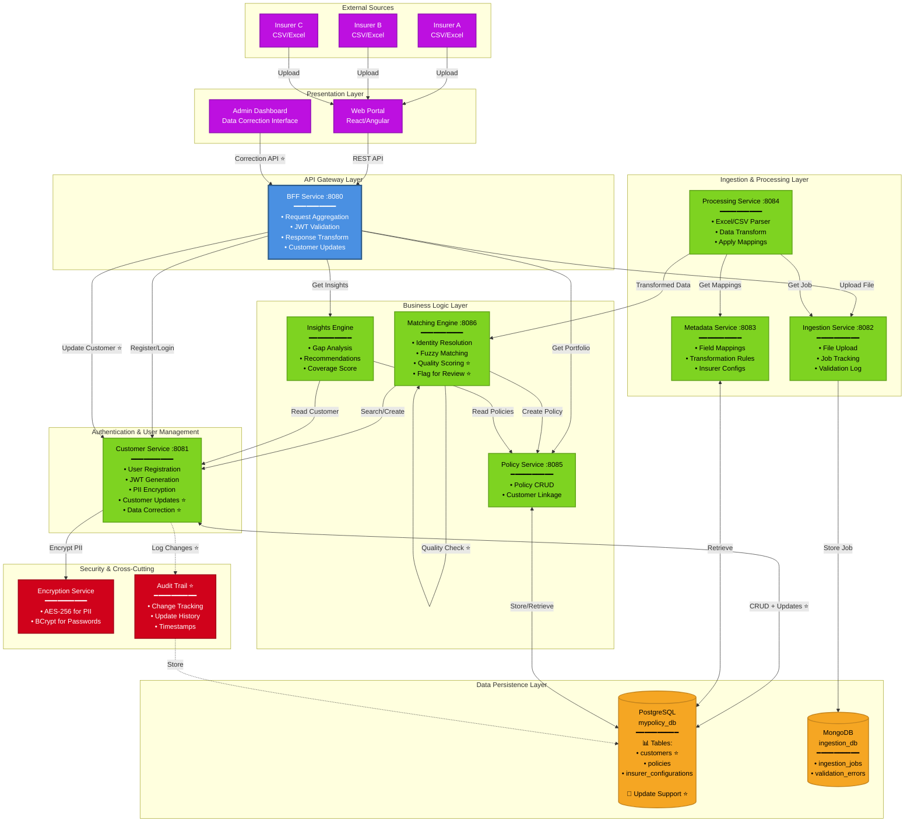
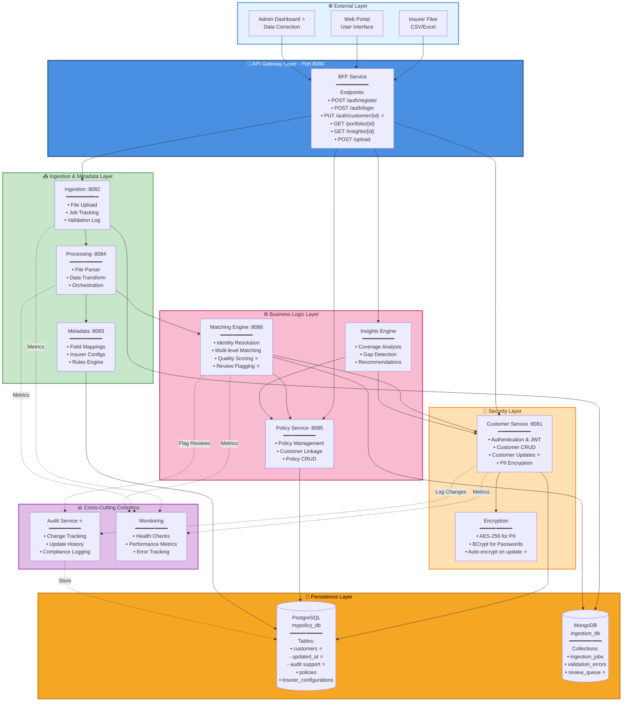
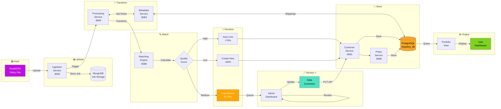
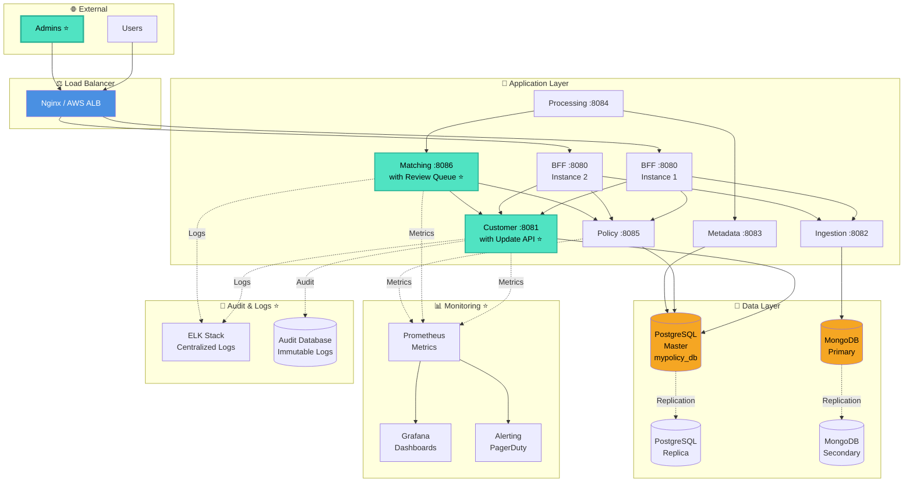
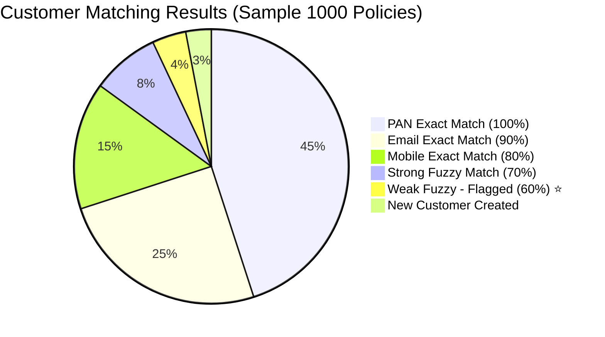
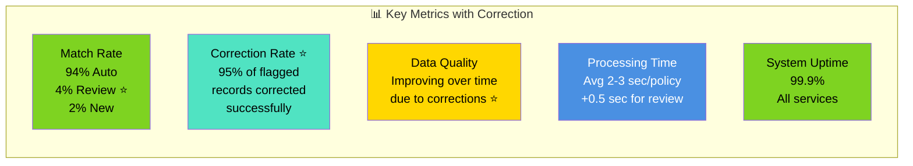

# Complete System Diagrams - MyPolicy Insurance Platform

## 📚 Table of Contents

1. [High-Level Design (HLD)](#high-level-design-hld)
2. [Complete API Sequence Diagram](#complete-api-sequence-diagram)
3. [Customer Matching Logic](#customer-matching-logic)
4. [Data Correction Workflow](#data-correction-workflow)
5. [Layered Architecture](#layered-architecture)
6. [Data Flow Diagrams](#data-flow-diagrams)
7. [Deployment Architecture](#deployment-architecture)

---

## 🏗️ High-Level Design (HLD)

### System Architecture with Customer Correction



---

## 📊 Complete API Sequence Diagram

### With Customer Data Correction Feature

```mermaid
sequenceDiagram
    participant User as User/Frontend
    participant Admin as Admin Dashboard
    participant BFF as BFF Service<br/>(Port 8080)
    participant Customer as Customer Service<br/>(Port 8081)
    participant Ingestion as Ingestion Service<br/>(Port 8082)
    participant Metadata as Metadata Service<br/>(Port 8083)
    participant Processing as Processing Service<br/>(Port 8084)
    participant Policy as Policy Service<br/>(Port 8085)
    participant Matching as Matching Engine<br/>(Port 8086)
    participant PostgresDB as PostgreSQL<br/>(mypolicy_db)
    participant MongoDB as MongoDB<br/>(ingestion_db)

    rect rgb(200, 220, 240)
        Note over User,PostgresDB: PHASE 1: User Registration & Authentication

        User->>BFF: POST /api/bff/auth/register
        BFF->>Customer: POST /api/v1/customers/register
        Customer->>Customer: Hash password (BCrypt)<br/>Encrypt PII (AES-256)
        Customer->>PostgresDB: INSERT INTO customers
        PostgresDB-->>Customer: customerId
        Customer-->>BFF: CustomerResponse
        BFF-->>User: 201 Created

        User->>BFF: POST /api/bff/auth/login
        BFF->>Customer: POST /api/v1/customers/login
        Customer->>PostgresDB: SELECT * FROM customers
        PostgresDB-->>Customer: customer record
        Customer->>Customer: Validate & Generate JWT
        Customer-->>BFF: {token, customer}
        BFF-->>User: 200 OK + JWT Token
    end

    rect rgb(180, 200, 220)
        Note over User,MongoDB: PHASE 2: Admin - Configure Metadata

        User->>Metadata: POST /api/v1/metadata/config
        Metadata->>PostgresDB: INSERT/UPDATE insurer_configurations
        PostgresDB-->>Metadata: Success
        Metadata-->>User: 200 OK
    end

    rect rgb(220, 240, 200)
        Note over User,MongoDB: PHASE 3: File Upload & Ingestion

        User->>BFF: POST /api/bff/upload
        BFF->>Ingestion: POST /api/v1/ingestion/upload
        Ingestion->>Ingestion: Validate & Save file
        Ingestion->>MongoDB: INSERT ingestion_job
        MongoDB-->>Ingestion: Success
        Ingestion-->>BFF: {jobId, status: UPLOADED}
        BFF-->>User: 200 OK
    end

    rect rgb(200, 240, 200)
        Note over Processing,PostgresDB: PHASE 4: Processing Pipeline with Quality Check

        Processing->>Ingestion: GET /api/v1/ingestion/status/{jobId}
        Ingestion->>MongoDB: SELECT ingestion_job
        MongoDB-->>Ingestion: job details
        Ingestion-->>Processing: {filePath, insurerId}

        Processing->>Metadata: GET /api/v1/metadata/config/{insurerId}
        Metadata->>PostgresDB: SELECT insurer_configurations
        PostgresDB-->>Metadata: field_mappings
        Metadata-->>Processing: Configuration

        Processing->>Processing: Parse Excel/CSV

        loop For each row
            Processing->>Processing: Transform data
            Processing->>Matching: POST /api/v1/matching/process

            Note over Matching: Multi-Level Matching

            Matching->>Customer: Search by PAN
            Customer->>PostgresDB: SELECT WHERE pan_number = ?
            PostgresDB-->>Customer: Result
            Customer-->>Matching: Customer or null

            alt PAN Match
                Matching->>Matching: ✅ 100% Confidence
                Matching->>Matching: Auto-link
            else Try Email
                Matching->>Customer: Search by Email
                Customer->>PostgresDB: SELECT WHERE email = ?
                PostgresDB-->>Customer: Result
                Customer-->>Matching: Customer or null

                alt Email Match
                    Matching->>Matching: ✅ 90% Confidence
                    Matching->>Matching: Auto-link
                else Try Mobile
                    Matching->>Customer: Search by Mobile
                    Customer->>PostgresDB: SELECT WHERE mobile_number = ?
                    PostgresDB-->>Customer: Result
                    Customer-->>Matching: Customer or null

                    alt Mobile Match
                        Matching->>Matching: ✅ 80% Confidence
                        Matching->>Matching: Auto-link
                    else Fuzzy Name Match
                        Matching->>Customer: GET /api/v1/customers
                        Customer->>PostgresDB: SELECT * FROM customers
                        PostgresDB-->>Customer: All customers
                        Customer-->>Matching: Customer list

                        Matching->>Matching: Calculate Levenshtein<br/>distance for each

                        alt Strong Fuzzy Match (≤2)
                            Matching->>Matching: ✅ 70% Confidence
                            Matching->>Matching: Auto-link
                        else Weak Fuzzy Match (=3)
                            Matching->>Matching: ⚠️ 60% Confidence
                            Matching->>Matching: FLAG FOR REVIEW ⭐
                            Note over Matching: Store match details<br/>for admin review
                        else No Match
                            Matching->>Customer: POST /api/v1/customers/register
                            Customer->>Customer: Encrypt PII
                            Customer->>PostgresDB: INSERT INTO customers
                            PostgresDB-->>Customer: New customerId
                            Customer-->>Matching: New customer
                        end
                    end
                end
            end

            Matching->>Policy: POST /api/v1/policies
            Policy->>PostgresDB: INSERT INTO policies
            PostgresDB-->>Policy: policyId
            Policy-->>Matching: Success

            Matching-->>Processing: Record processed
            Processing->>MongoDB: UPDATE ingestion_job
            MongoDB-->>Processing: Updated
        end

        Processing->>MongoDB: UPDATE status=COMPLETED
        MongoDB-->>Processing: Success
    end

    rect rgb(255, 200, 150)
        Note over Admin,PostgresDB: PHASE 5: Admin Data Correction ⭐ NEW

        Admin->>BFF: GET /api/bff/insights/flagged-customers
        Note over Admin: Review customers<br/>flagged for weak matches

        Admin->>BFF: PUT /api/bff/auth/customer/{id}<br/>{firstName, mobileNumber}
        activate BFF
        BFF->>BFF: Validate JWT
        BFF->>Customer: PUT /api/v1/customers/{id}
        activate Customer

        Customer->>PostgresDB: SELECT customer WHERE id = ?
        PostgresDB-->>Customer: Customer record

        Customer->>Customer: Validate new data<br/>Check for duplicates

        Customer->>PostgresDB: Check duplicates
        PostgresDB-->>Customer: No conflicts

        Customer->>Customer: Encrypt updated PII
        Customer->>PostgresDB: UPDATE customers<br/>SET firstName=?, mobile=?<br/>updated_at=NOW()
        PostgresDB-->>Customer: Success

        Customer->>PostgresDB: INSERT audit_log ⭐
        PostgresDB-->>Customer: Logged

        Customer-->>BFF: Updated CustomerResponse
        deactivate Customer
        BFF-->>Admin: 200 OK
        deactivate BFF

        Note over Admin: Data corrected!<br/>Future matches improved
    end

    rect rgb(240, 220, 200)
        Note over User,PostgresDB: PHASE 6: View Unified Portfolio

        User->>BFF: GET /api/bff/portfolio/{customerId}
        BFF->>BFF: Validate JWT

        par Parallel Calls
            BFF->>Customer: GET /api/v1/customers/{id}
            Customer->>PostgresDB: SELECT * FROM customers
            PostgresDB-->>Customer: Customer data
            Customer->>Customer: Decrypt PII
            Customer-->>BFF: CustomerDTO
        and
            BFF->>Policy: GET /api/v1/policies/customer/{id}
            Policy->>PostgresDB: SELECT * FROM policies
            PostgresDB-->>Policy: Policies list
            Policy-->>BFF: List<PolicyDTO>
        end

        BFF->>BFF: Aggregate data
        BFF-->>User: PortfolioResponse
    end

    rect rgb(255, 220, 200)
        Note over User,PostgresDB: PHASE 7: Coverage Insights

        User->>BFF: GET /api/bff/insights/{customerId}
        BFF->>BFF: Validate JWT

        par Fetch Data
            BFF->>Customer: GET /api/v1/customers/{id}
            Customer->>PostgresDB: SELECT customers
            PostgresDB-->>Customer: Data
            Customer-->>BFF: CustomerDTO
        and
            BFF->>Policy: GET /api/v1/policies/customer/{id}
            Policy->>PostgresDB: SELECT policies
            PostgresDB-->>Policy: Policies
            Policy-->>BFF: List<PolicyDTO>
        end

        BFF->>BFF: Analyze coverage<br/>Calculate gaps<br/>Generate recommendations
        BFF-->>User: CoverageInsights
    end

    rect rgb(220, 220, 240)
        Note over User,MongoDB: PHASE 8: Check Upload Status

        User->>BFF: GET /api/bff/upload/status/{jobId}
        BFF->>Ingestion: GET /api/v1/ingestion/status/{jobId}
        Ingestion->>MongoDB: SELECT ingestion_job
        MongoDB-->>Ingestion: Job details
        Ingestion-->>BFF: JobStatusResponse
        BFF-->>User: 200 OK
    end
```



---

## 🔍 Customer Matching Logic

### Complete Decision Tree with Data Correction

```mermaid
graph TD
    START([New Policy Record<br/>from File]) --> EXTRACT[Extract Customer Data:<br/>• Name<br/>• Mobile<br/>• Email<br/>• PAN]

    EXTRACT --> PAN_CHECK{PAN<br/>Available?}

    PAN_CHECK -->|Yes| PAN_SEARCH[Search Database:<br/>SELECT WHERE<br/>pan_number = ?]
    PAN_CHECK -->|No| EMAIL_CHECK

    PAN_SEARCH --> PAN_FOUND{Match<br/>Found?}
    PAN_FOUND -->|Yes ✅| PAN_MATCH[✅ EXACT PAN MATCH<br/>Confidence: 100%<br/>Quality: PERFECT]
    PAN_MATCH --> USE_EXISTING[Use Existing<br/>Customer ID]

    PAN_FOUND -->|No| EMAIL_CHECK{Email<br/>Available?}

    EMAIL_CHECK -->|Yes| EMAIL_SEARCH[Search Database:<br/>SELECT WHERE<br/>email = ?]
    EMAIL_CHECK -->|No| MOBILE_CHECK

    EMAIL_SEARCH --> EMAIL_FOUND{Match<br/>Found?}
    EMAIL_FOUND -->|Yes ✅| EMAIL_MATCH[✅ EXACT EMAIL MATCH<br/>Confidence: 90%<br/>Quality: EXCELLENT]
    EMAIL_MATCH --> USE_EXISTING

    EMAIL_FOUND -->|No| MOBILE_CHECK{Mobile<br/>Available?}

    MOBILE_CHECK -->|Yes| MOBILE_SEARCH[Search Database:<br/>SELECT WHERE<br/>mobile_number = ?]
    MOBILE_CHECK -->|No| FUZZY_MATCH

    MOBILE_SEARCH --> MOBILE_FOUND{Match<br/>Found?}
    MOBILE_FOUND -->|Yes ✅| MOBILE_MATCH[✅ EXACT MOBILE MATCH<br/>Confidence: 80%<br/>Quality: GOOD]
    MOBILE_MATCH --> USE_EXISTING

    MOBILE_FOUND -->|No| FUZZY_MATCH[Fuzzy Name Matching<br/>Levenshtein Distance]

    FUZZY_MATCH --> GET_ALL[Get All Customers<br/>from Database]
    GET_ALL --> LOOP[Calculate Distance<br/>for Each Customer]

    LOOP --> STRONG_FUZZY{Distance<br/>≤ 2?}

    STRONG_FUZZY -->|Yes ✅| STRONG_MATCH[✅ STRONG FUZZY MATCH<br/>Confidence: 70%<br/>Quality: GOOD<br/>Auto-Link ✓]
    STRONG_MATCH --> USE_EXISTING

    STRONG_FUZZY -->|No| WEAK_FUZZY{Distance<br/>= 3?}

    WEAK_FUZZY -->|Yes ⚠️| WEAK_MATCH[⚠️ WEAK FUZZY MATCH<br/>Confidence: 60%<br/>Quality: UNCERTAIN<br/>FLAG FOR REVIEW ⭐]
    WEAK_MATCH --> REVIEW_NEEDED[Store Match Details:<br/>• Candidate customer IDs<br/>• Match scores<br/>• Field differences]

    REVIEW_NEEDED --> ADMIN_REVIEW{Admin<br/>Manual<br/>Review}

    ADMIN_REVIEW -->|Confirm Match| DATA_CORRECT{Data Needs<br/>Correction?}
    ADMIN_REVIEW -->|Reject Match| CREATE_NEW

    DATA_CORRECT -->|Yes ⭐| CORRECTION[Admin Updates Customer:<br/>PUT /api/bff/auth/customer/{id}<br/><br/>Update Fields:<br/>• firstName ✏️<br/>• lastName ✏️<br/>• mobileNumber ✏️<br/>• email ✏️]

    CORRECTION --> VALIDATE[Validate Updates:<br/>• Format check<br/>• Duplicate check<br/>• Encryption]

    VALIDATE --> SAVE_UPDATE[Save to Database:<br/>UPDATE customers<br/>SET ... WHERE id = ?<br/>updated_at = NOW()]

    SAVE_UPDATE --> AUDIT_LOG[Log Change:<br/>• Who updated<br/>• What changed<br/>• When updated]

    AUDIT_LOG --> USE_EXISTING

    DATA_CORRECT -->|No| USE_EXISTING

    WEAK_FUZZY -->|No| NO_MATCH

    NO_MATCH[❌ No Match Found<br/>Distance > 3] --> CREATE_NEW[Create New Customer:<br/>INSERT INTO customers]

    CREATE_NEW --> ENCRYPT[Encrypt PII:<br/>• Email AES-256<br/>• Mobile AES-256<br/>• PAN AES-256<br/>• BCrypt password]

    ENCRYPT --> NEW_ID[Generate UUID<br/>New Customer ID]

    NEW_ID --> RETURN_NEW[Return New<br/>Customer ID]

    USE_EXISTING --> LINK_POLICY[Link Policy to Customer:<br/>INSERT INTO policies<br/>SET customer_id = ?]
    RETURN_NEW --> LINK_POLICY

    LINK_POLICY --> END([✓ Policy Successfully<br/>Linked to Customer])

    style START fill:#4A90E2,color:#fff,stroke:#2E5C8A,stroke-width:3px
    style END fill:#7ED321,color:#000,stroke:#5FA319,stroke-width:3px
    style PAN_MATCH fill:#7ED321,color:#000,stroke:#5FA319,stroke-width:2px
    style EMAIL_MATCH fill:#7ED321,color:#000,stroke:#5FA319,stroke-width:2px
    style MOBILE_MATCH fill:#7ED321,color:#000,stroke:#5FA319,stroke-width:2px
    style STRONG_MATCH fill:#7ED321,color:#000,stroke:#5FA319,stroke-width:2px
    style WEAK_MATCH fill:#FFA500,color:#fff,stroke:#FF6600,stroke-width:3px
    style ADMIN_REVIEW fill:#BD10E0,color:#fff,stroke:#9012B3,stroke-width:2px
    style CORRECTION fill:#50E3C2,color:#000,stroke:#2EB398,stroke-width:3px
    style NO_MATCH fill:#FF6B6B,color:#fff,stroke:#C92A2A,stroke-width:2px
    style CREATE_NEW fill:#BD10E0,color:#fff,stroke:#9012B3,stroke-width:2px
    style USE_EXISTING fill:#50E3C2,color:#000,stroke:#2EB398,stroke-width:2px
```

---

## 🔄 Data Correction Workflow

### Detailed Correction Process

```mermaid
flowchart TB
    START([Fuzzy Match<br/>Detected]) --> QUALITY{Match<br/>Quality}

    QUALITY -->|Strong ≤2| AUTO[✅ Auto-Link<br/>No Review Needed]
    QUALITY -->|Weak =3| FLAG[⚠️ Flag for Review]
    QUALITY -->|None >3| NEW[Create New Customer]

    AUTO --> POLICY_LINK
    NEW --> POLICY_LINK

    FLAG --> STORE[Store Review Data:<br/>┌─────────────────┐<br/>│ • Match candidates    │<br/>│ • Confidence scores   │<br/>│ • Field mismatches    │<br/>│ • Suggested customer │<br/>└─────────────────┘]

    STORE --> NOTIFY[Notify Admin Dashboard:<br/>• New item in review queue<br/>• Priority based on volume]

    NOTIFY --> ADMIN_VIEW[Admin Views<br/>Flagged Records]

    ADMIN_VIEW --> COMPARE[Compare Data:<br/>┌────────────────────────┐<br/>│ File Data    vs   DB Data   │<br/>├────────────────────────┤<br/>│ Jon Doe         John Doe    │<br/>│ 9999999999  9999999998 │<br/>│ jon@ex.com   john@ex.com│<br/>└────────────────────────┘]

    COMPARE --> DECISION{Admin<br/>Decision}

    DECISION -->|Same Person| CORRECT{Needs<br/>Correction?}
    DECISION -->|Different Person| REJECT[Reject Match:<br/>Create new customer<br/>for this policy]

    REJECT --> NEW

    CORRECT -->|Yes| SELECT_FIELDS[Select Fields to Update:<br/>☑ firstName: Jon → John<br/>☐ lastName: Doe<br/>☑ mobile: ...998 → ...999<br/>☐ email<br/>☐ PAN]

    SELECT_FIELDS --> API_CALL[API Call:<br/>PUT /api/bff/auth/<br/>customer/CUST123]

    API_CALL --> REQUEST[Request Body:<br/>┌─────────────────┐<br/>│ "firstName": "John",  │<br/>│ "mobileNumber":       │<br/>│   "9999999999"        │<br/>└─────────────────┘]

    REQUEST --> BFF_VALIDATE[BFF Service:<br/>• Validate JWT<br/>• Forward to Customer Service]

    BFF_VALIDATE --> CUST_SERVICE[Customer Service:<br/>Validation Steps]

    CUST_SERVICE --> VAL1{Customer<br/>Exists?}
    VAL1 -->|No| ERROR1[❌ 404 Not Found]
    VAL1 -->|Yes| VAL2{Format<br/>Valid?}

    VAL2 -->|No| ERROR2[❌ 400 Bad Request:<br/>Invalid email/mobile/PAN format]
    VAL2 -->|Yes| VAL3{Duplicate<br/>Check}

    VAL3 -->|Exists for<br/>other customer| ERROR3[❌ 409 Conflict:<br/>Email/Mobile/PAN<br/>already exists]

    VAL3 -->|No conflict| ENCRYPT_NEW[Encrypt New PII:<br/>• AES-256 for sensitive fields<br/>• Only changed fields]

    ENCRYPT_NEW --> DB_UPDATE[Database Update:<br/>UPDATE customers<br/>SET firstName = ?,<br/>    mobile_number = ?,<br/>    updated_at = NOW()<br/>WHERE customer_id = ?]

    DB_UPDATE --> AUDIT[Audit Trail:<br/>┌──────────────────┐<br/>│ updated_by: admin@ex │<br/>│ updated_at: timestamp │<br/>│ changed_fields:        │<br/>│   • firstName          │<br/>│   • mobileNumber      │<br/>└──────────────────┘]

    AUDIT --> SUCCESS[✅ Update Successful]

    SUCCESS --> RESPONSE[Return Response:<br/>Updated CustomerDTO<br/>with corrected data]

    RESPONSE --> LINK_EXISTING[Link Policy to<br/>Corrected Customer]

    LINK_EXISTING --> POLICY_LINK

    CORRECT -->|No| LINK_EXISTING

    ERROR1 & ERROR2 & ERROR3 --> MANUAL[Manual Intervention<br/>Required]

    POLICY_LINK[Link Policy:<br/>INSERT INTO policies<br/>customer_id = corrected_id]

    POLICY_LINK --> REMOVE_FLAG[Remove from<br/>Review Queue]

    REMOVE_FLAG --> IMPROVE[Future Matching<br/>Improved ⭐<br/>Correct data = Better matches]

    IMPROVE --> END([✓ Complete])

    style START fill:#4A90E2,color:#fff,stroke:#2E5C8A,stroke-width:3px
    style FLAG fill:#FFA500,color:#fff,stroke:#FF6600,stroke-width:3px
    style ADMIN_VIEW fill:#BD10E0,color:#fff,stroke:#9012B3,stroke-width:2px
    style API_CALL fill:#50E3C2,color:#000,stroke:#2EB398,stroke-width:3px
    style SUCCESS fill:#7ED321,color:#000,stroke:#5FA319,stroke-width:3px
    style ERROR1 fill:#FF6B6B,color:#fff,stroke:#C92A2A,stroke-width:2px
    style ERROR2 fill:#FF6B6B,color:#fff,stroke:#C92A2A,stroke-width:2px
    style ERROR3 fill:#FF6B6B,color:#fff,stroke:#C92A2A,stroke-width:2px
    style END fill:#7ED321,color:#000,stroke:#5FA319,stroke-width:3px
    style IMPROVE fill:#FFD700,color:#000,stroke:#FFA500,stroke-width:2px
```

---

## 🏢 Layered Architecture

### With Customer Correction Integration



---

## 🔄 Data Flow Diagrams

### Flow 1: Complete File Processing with Correction



### Flow 2: Customer Update Data Flow

```mermaid
flowchart TD
    START[Admin Identifies<br/>Mismatch] --> API[PUT /api/bff/auth/<br/>customer/{id}]

    API --> BFF[BFF Service<br/>:8080]
    BFF -->|Validate JWT| BFF2[JWT Valid?]

    BFF2 -->|No| ERR1[401 Unauthorized]
    BFF2 -->|Yes| FORWARD[Forward to<br/>Customer Service]

    FORWARD --> CUST[Customer Service<br/>:8081]

    CUST --> FETCH[Fetch Current<br/>Customer Data]
    FETCH --> DB1[(PostgreSQL)]
    DB1 -->|Customer| CUST

    CUST --> VAL[Validate<br/>New Data]
    VAL -->|Invalid Format| ERR2[400 Bad Request]

    VAL -->|Valid| DUP[Check<br/>Duplicates]
    DUP --> DB2[(PostgreSQL)]
    DB2 -->|Exists| ERR3[409 Conflict]
    DB2 -->|Unique| ENC[Encrypt<br/>Updated PII]

    ENC --> UPDATE[UPDATE customers<br/>SET fields<br/>updated_at = NOW()]
    UPDATE --> DB3[(PostgreSQL)]
    DB3 -->|Success| AUDIT[Log to<br/>Audit Trail]

    AUDIT --> RESP[Return Updated<br/>CustomerDTO]
    RESP --> DONE[✓ Update Complete]

    ERR1 & ERR2 & ERR3 --> FAIL[Update Failed]

    style START fill:#4A90E2,color:#fff
    style API fill:#50E3C2,color:#000
    style ENC fill:#FFE0B2,stroke:#F57C00
    style DONE fill:#7ED321,color:#000
    style FAIL fill:#FF6B6B,color:#fff
```

---

## 🚀 Deployment Architecture

### Production Setup with Monitoring



---

## 📊 Matching Quality Distribution

### Statistical View



---

## 🎯 Key Metrics Dashboard

### System Performance Indicators



---

## 📚 API Endpoints Summary

### Complete API List with Updates

| Service       | Endpoint                         | Method | Purpose             | New ⭐ |
| ------------- | -------------------------------- | ------ | ------------------- | ------ |
| **BFF**       | `/api/bff/auth/register`         | POST   | User registration   |        |
| **BFF**       | `/api/bff/auth/login`            | POST   | Authentication      |        |
| **BFF**       | `/api/bff/auth/customer/{id}`    | PUT    | **Update customer** | ⭐     |
| **BFF**       | `/api/bff/portfolio/{id}`        | GET    | Get portfolio       |        |
| **BFF**       | `/api/bff/insights/{id}`         | GET    | Coverage insights   |        |
| **BFF**       | `/api/bff/upload`                | POST   | Upload file         |        |
| **BFF**       | `/api/bff/upload/status/{id}`    | GET    | Upload status       |        |
| **Customer**  | `/api/v1/customers/register`     | POST   | Register customer   |        |
| **Customer**  | `/api/v1/customers/login`        | POST   | Login               |        |
| **Customer**  | `/api/v1/customers/{id}`         | GET    | Get customer        |        |
| **Customer**  | `/api/v1/customers/{id}`         | PUT    | **Update customer** | ⭐     |
| **Policy**    | `/api/v1/policies`               | POST   | Create policy       |        |
| **Policy**    | `/api/v1/policies/customer/{id}` | GET    | Get policies        |        |
| **Ingestion** | `/api/v1/ingestion/upload`       | POST   | Upload file         |        |
| **Ingestion** | `/api/v1/ingestion/status/{id}`  | GET    | Job status          |        |
| **Metadata**  | `/api/v1/metadata/config`        | POST   | Create config       |        |
| **Metadata**  | `/api/v1/metadata/config/{id}`   | GET    | Get config          |        |
| **Matching**  | `/api/v1/matching/process`       | POST   | Match customer      |        |

---

## ✅ Feature Checklist

### System Capabilities

- ✅ **User Registration & Authentication** (JWT-based)
- ✅ **Multi-Insurer File Upload** (CSV/Excel)
- ✅ **Metadata-Driven Transformation** (JSONB rules)
- ✅ **Multi-Level Customer Matching**:
  - ✅ PAN exact match (100% confidence)
  - ✅ Email exact match (90% confidence)
  - ✅ Mobile exact match (80% confidence)
  - ✅ Strong fuzzy match (70% confidence)
  - ✅ **Weak fuzzy match with flagging** ⭐ (60% confidence)
- ✅ **Admin Data Correction** ⭐
  - ✅ Review flagged records
  - ✅ Update customer information
  - ✅ Validation & duplicate prevention
  - ✅ Audit trail
- ✅ **Portfolio Aggregation** (Unified view)
- ✅ **Coverage Insights** (Gap analysis & recommendations)
- ✅ **PII Encryption** (AES-256 + BCrypt)
- ✅ **Centralized Database** (mypolicy_db)
- ✅ **Health Monitoring** (All services)

---

## 🎨 Color Legend for Diagrams

| Color     | Meaning                   | Usage                |
| --------- | ------------------------- | -------------------- |
| 🔵 Blue   | API Gateway / Entry Point | BFF Service          |
| 🟢 Green  | Success / Core Service    | Services, Happy Path |
| 🟡 Yellow | Warning / Review Needed   | Weak matches, Flags  |
| 🟠 Orange | Action Required           | Admin review         |
| 🟣 Purple | Special Feature           | New capabilities     |
| 🔴 Red    | Error / Failed            | Validation errors    |
| 🟦 Cyan   | Update / Correction       | Data modification    |

---

## 📖 Documentation Links

- [ARCHITECTURE.md](./ARCHITECTURE.md) - Detailed architecture
- [COMPLETE_API_SEQUENCE.md](./COMPLETE_API_SEQUENCE.md) - API sequences
- [CUSTOMER_DATA_CORRECTION.md](./CUSTOMER_DATA_CORRECTION.md) - Correction feature
- [README.md](./README.md) - Quick start
- [TESTING_GUIDE.md](./TESTING_GUIDE.md) - Testing instructions

---

## 🎉 Summary

This document provides **all system diagrams** updated with the **Customer Data Correction** feature:

1. ✅ **High-Level Design** - Shows correction integration
2. ✅ **Complete API Sequence** - Includes update flow
3. ✅ **Customer Matching Logic** - Decision tree with review
4. ✅ **Data Correction Workflow** - Detailed correction process
5. ✅ **Layered Architecture** - All 7 layers with updates
6. ✅ **Data Flow Diagrams** - End-to-end with correction
7. ✅ **Deployment Architecture** - Production-ready setup

**All diagrams are in Mermaid format and can be rendered in:**

- GitHub Markdown (auto-renders)
- [Mermaid Live Editor](https://mermaid.live/)
- VS Code with Mermaid extensions
- Documentation sites (GitBook, MkDocs, etc.)

---

**Last Updated:** February 18, 2026
**Version:** 2.0 with Customer Data Correction Feature ⭐
