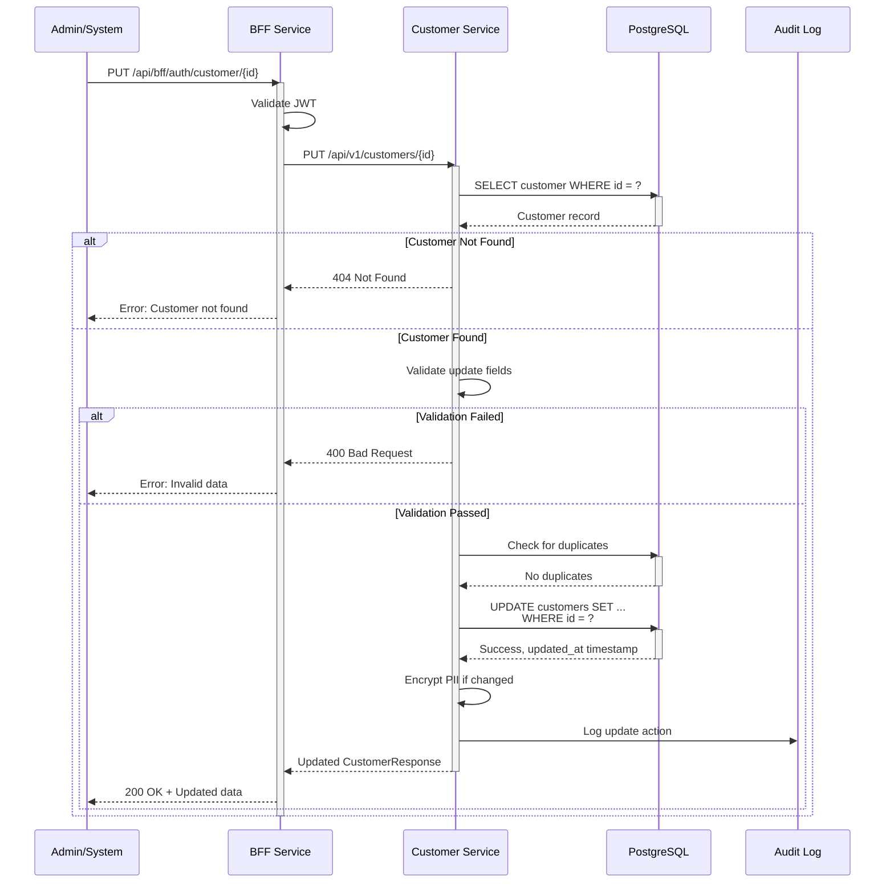

# Customer Data Correction Feature

## 📋 Overview

This document describes the **Customer Data Update/Correction** feature that allows backend administrators or automated systems to correct customer information when fuzzy matching identifies mismatches or data quality issues.

---

## 🎯 Purpose

When the **Matching Engine** identifies potential data mismatches during policy ingestion (e.g., slightly different names, phone numbers), administrators can correct the customer data in the backend to improve future matching accuracy.

---

## 🔧 Implementation

### **1. Customer Service API**

#### **Update Customer Endpoint**

```http
PUT /api/v1/customers/{customerId}
Content-Type: application/json

{
  "firstName": "John",
  "lastName": "Smith",
  "email": "john.smith@example.com",
  "mobileNumber": "9876543210",
  "panNumber": "ABCDE1234F",
  "dateOfBirth": "1990-01-15",
  "address": "123 Main St, City"
}
```

**Response:**

```json
{
  "customerId": "uuid-here",
  "firstName": "John",
  "lastName": "Smith",
  "email": "john.smith@example.com",
  "mobileNumber": "9876543210",
  "panNumber": "ABCDE1234F",
  "status": "ACTIVE",
  "dateOfBirth": "1990-01-15",
  "address": "123 Main St, City"
}
```

---

### **2. BFF Service API**

#### **Update Customer via BFF**

```http
PUT /api/bff/auth/customer/{customerId}
Content-Type: application/json
Authorization: Bearer <JWT_TOKEN>

{
  "firstName": "John",
  "lastName": "Smith",
  "mobileNumber": "9876543210"
}
```

---

## 📊 Data Correction Workflow

```mermaid
flowchart TD
    START([Policy Upload]) --> PROCESS[Processing Service<br/>Extracts Data]
    PROCESS --> MATCH[Matching Engine<br/>Fuzzy Match]

    MATCH --> FUZZY_RESULT{Match Quality}

    FUZZY_RESULT -->|Strong Match<br/>Distance ≤ 2| AUTO[Automatic Link]
    FUZZY_RESULT -->|Weak Match<br/>Distance = 3| REVIEW[Flag for Review]
    FUZZY_RESULT -->|No Match| CREATE[Create New Customer]

    AUTO --> POLICY_LINK[Link Policy]
    CREATE --> POLICY_LINK

    REVIEW --> ADMIN_REVIEW{Admin<br/>Review}

    ADMIN_REVIEW -->|Confirm Match| CORRECT{Data<br/>Needs<br/>Correction?}
    ADMIN_REVIEW -->|Reject Match| CREATE

    CORRECT -->|Yes| UPDATE[PUT /api/bff/auth/customer/{id}<br/>Update Customer Data]
    CORRECT -->|No| POLICY_LINK

    UPDATE --> AUDIT[Log Correction in Audit Trail]
    AUDIT --> POLICY_LINK

    POLICY_LINK --> DONE([Policy Successfully Linked])

    style REVIEW fill:#FFA500,color:#fff
    style UPDATE fill:#4A90E2,color:#fff
    style AUDIT fill:#BD10E0,color:#fff
    style DONE fill:#7ED321,color:#000
```

---

## 🔍 Use Cases

### **Use Case 1: Name Spelling Correction**

**Scenario:** File shows "Jon Doe" but database has "John Doe"

**Steps:**

1. Matching engine finds fuzzy match (distance = 1)
2. Admin reviews and confirms it's the same person
3. Admin updates customer name to "John Doe" for consistency
4. Policy gets linked to correct customer

**API Call:**

```bash
curl -X PUT http://localhost:8080/api/bff/auth/customer/CUST123 \
  -H "Content-Type: application/json" \
  -H "Authorization: Bearer <token>" \
  -d '{
    "firstName": "John",
    "lastName": "Doe"
  }'
```

---

### **Use Case 2: Phone Number Update**

**Scenario:** Customer changed mobile number from 9999999999 to 8888888888

**Steps:**

1. New policy file has updated mobile number
2. Matching fails on mobile, but matches on PAN
3. Admin updates mobile number in system
4. Future policies will match correctly

**API Call:**

```bash
curl -X PUT http://localhost:8080/api/bff/auth/customer/CUST123 \
  -H "Content-Type: application/json" \
  -H "Authorization: Bearer <token>" \
  -d '{
    "mobileNumber": "8888888888"
  }'
```

---

### **Use Case 3: Email Correction**

**Scenario:** Typo in original email: "john@gmial.com" should be "john@gmail.com"

**API Call:**

```bash
curl -X PUT http://localhost:8080/api/bff/auth/customer/CUST123 \
  -H "Content-Type: application/json" \
  -d '{
    "email": "john@gmail.com"
  }'
```

---

## 🛡️ Security & Validation

### **Field-Level Validation**

| Field         | Validation         | Error Message                     |
| ------------- | ------------------ | --------------------------------- |
| **Email**     | RFC 5322 format    | "Invalid email format"            |
| **Mobile**    | 10 digits          | "Mobile number must be 10 digits" |
| **PAN**       | Format: ABCDE1234F | "Invalid PAN format"              |
| **firstName** | Not empty          | Auto-validated by Spring          |
| **lastName**  | Not empty          | Auto-validated by Spring          |

### **Duplicate Check**

Before updating, the system checks if the new value already exists for another customer:

```java
// Example: Updating email
if (newEmail exists for different customer) {
  throw new RuntimeException("Email already exists for another customer");
}
```

---

## 🔄 Update Workflow Sequence



---

## 📝 Partial Update Support

The update API supports **partial updates** - only send fields you want to change:

**Example: Update only mobile number**

```json
{
  "mobileNumber": "9999999999"
}
```

**Example: Update name and email**

```json
{
  "firstName": "John",
  "lastName": "Smith",
  "email": "john.smith@example.com"
}
```

**All other fields remain unchanged.**

---

## 🔐 Encryption Handling

When PII fields (email, mobile, PAN) are updated, they are automatically encrypted using **AES-256** before storage:

```java
if (request.getEmail() != null) {
  customer.setEmail(request.getEmail()); // Auto-encrypted by JPA listener
}
```

---

## 📊 Audit Trail

Every update is tracked with:

- `updated_at` timestamp (automatically set)
- Who made the change (from JWT token)
- What was changed (can be implemented in audit service)

---

## 🎯 Integration with Matching Engine

### **Before Data Correction Feature:**

```
File: "Jon Doe" → Fuzzy Match → Manual intervention needed → Create duplicate
```

### **After Data Correction Feature:**

```
File: "Jon Doe" → Fuzzy Match → Admin corrects to "John Doe" → Future matches automatic
```

---

## 🚀 Testing the Feature

### **1. Register a customer**

```bash
curl -X POST http://localhost:8080/api/bff/auth/register \
  -H "Content-Type: application/json" \
  -d '{
    "firstName": "Jon",
    "lastName": "Doe",
    "email": "jon@example.com",
    "mobileNumber": "9876543210",
    "password": "Pass123"
  }'
```

### **2. Login to get JWT token**

```bash
curl -X POST http://localhost:8080/api/bff/auth/login \
  -H "Content-Type: application/json" \
  -d '{
    "email": "jon@example.com",
    "password": "Pass123"
  }'
```

### **3. Update customer data (use customer ID from step 1)**

```bash
curl -X PUT http://localhost:8080/api/bff/auth/customer/CUST123 \
  -H "Content-Type: application/json" \
  -H "Authorization: Bearer <token_from_step_2>" \
  -d '{
    "firstName": "John",
    "email": "john@example.com"
  }'
```

### **4. Verify update**

```bash
curl -X GET http://localhost:8080/api/bff/portfolio/CUST123 \
  -H "Authorization: Bearer <token>"
```

---

## 🔧 Configuration

No additional configuration needed. The feature is automatically available once deployed.

**Service Ports:**

- Customer Service: 8081
- BFF Service: 8080

---

## ⚡ Performance Considerations

1. **Duplicate Check Queries:** Indexed on email, mobile, PAN for fast lookup
2. **Transaction Management:** All updates are transactional (ACID compliant)
3. **Encryption Overhead:** Minimal (done before database write)

---

## 🎨 Future Enhancements

1. **Audit Service:** Dedicated service to track all changes
2. **Change History:** View all updates made to a customer record
3. **Bulk Update API:** Update multiple customers at once
4. **Data Quality Dashboard:** Show customers flagged for review
5. **Automatic Suggestions:** ML model to suggest corrections

---

## 📚 Related Documentation

- [ARCHITECTURE.md](./ARCHITECTURE.md) - System architecture
- [COMPLETE_API_SEQUENCE.md](./COMPLETE_API_SEQUENCE.md) - API flows
- [API_REFERENCE.md](./bff-service/API_REFERENCE.md) - Complete API documentation

---

## ✅ Summary

The Customer Data Correction feature provides a robust mechanism to:

- ✅ Correct mismatched data from fuzzy matching
- ✅ Update customer information as it changes over time
- ✅ Improve future matching accuracy
- ✅ Maintain data quality and consistency
- ✅ Support partial updates (only change what's needed)
- ✅ Validate data before updates
- ✅ Prevent duplicate entries
- ✅ Maintain security with encryption

**This ensures the system adapts to real-world data variations and improves over time!** 🎉
