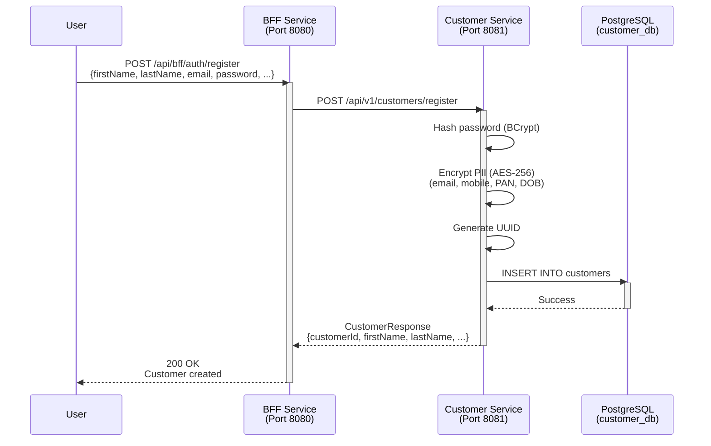
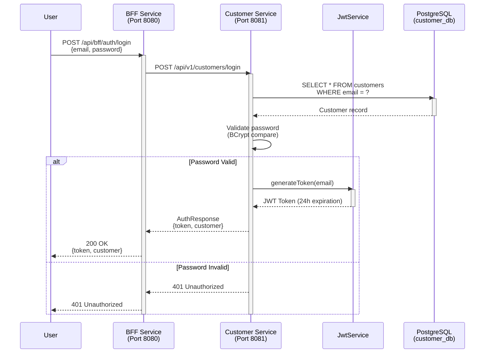
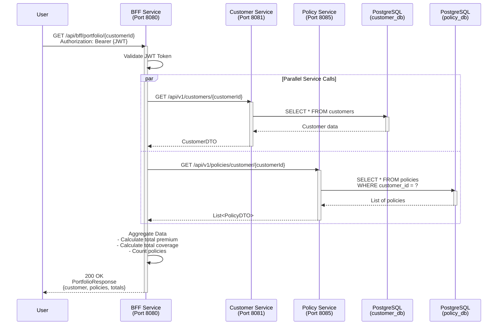
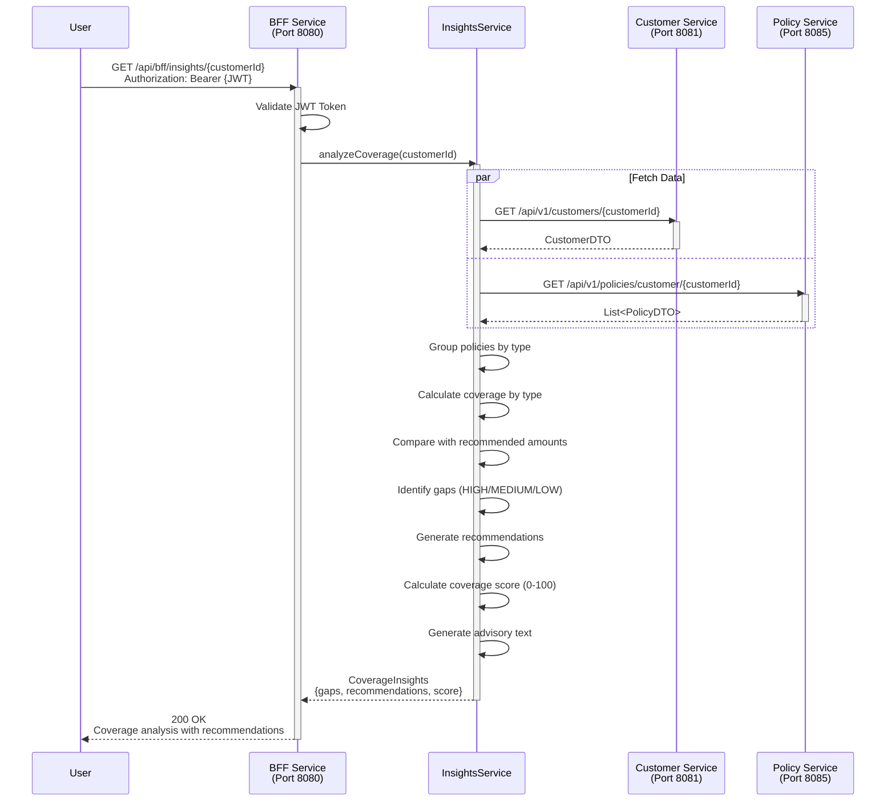
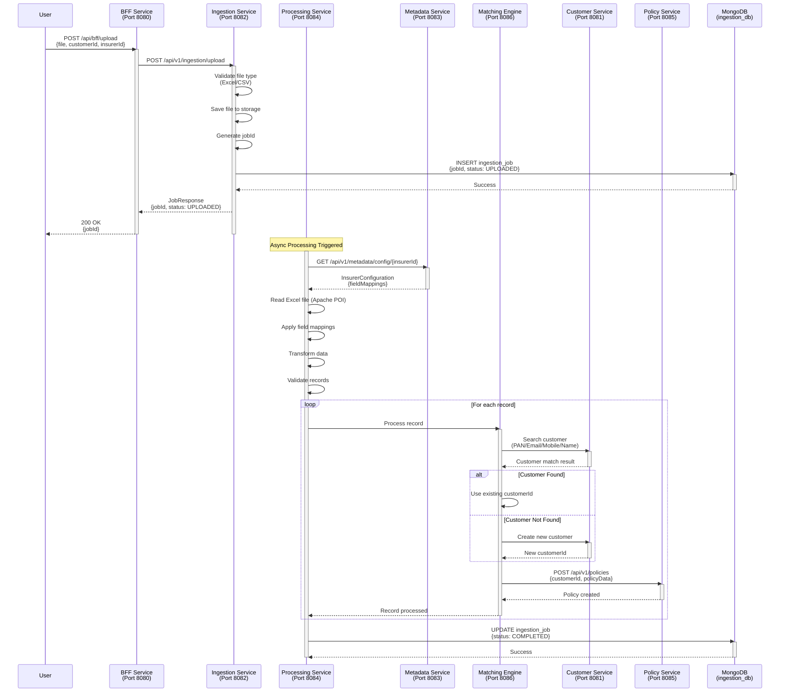
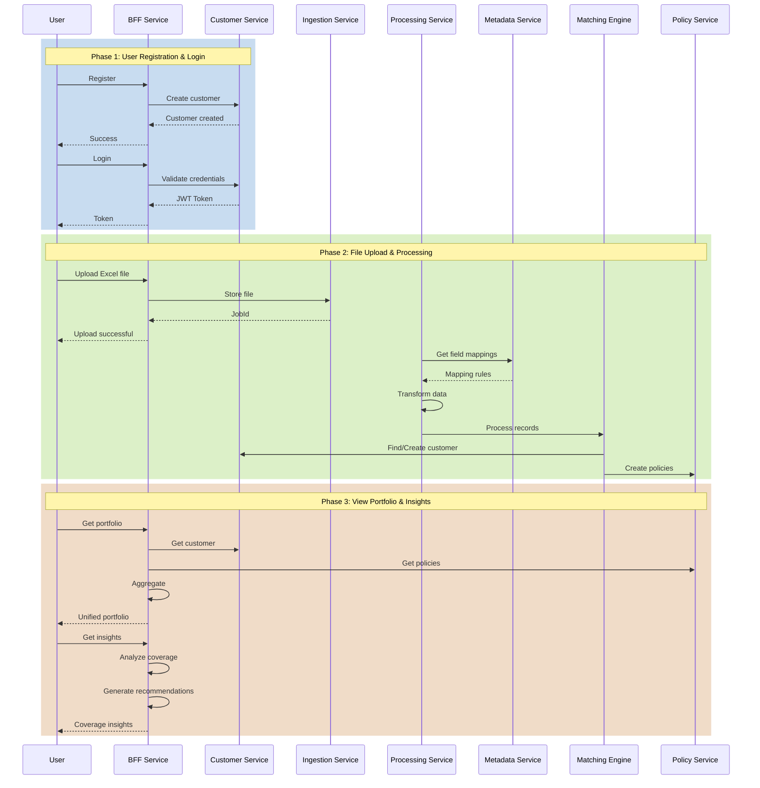
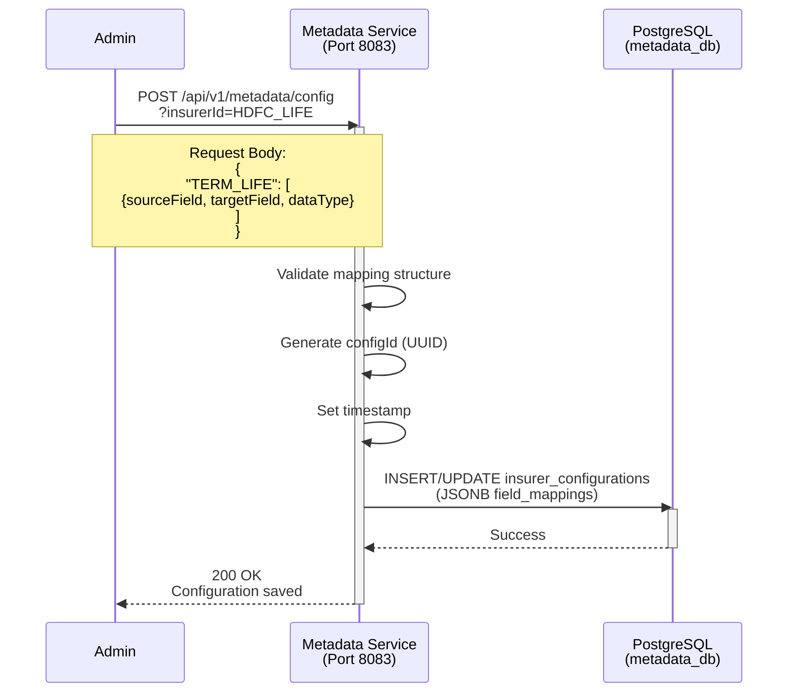
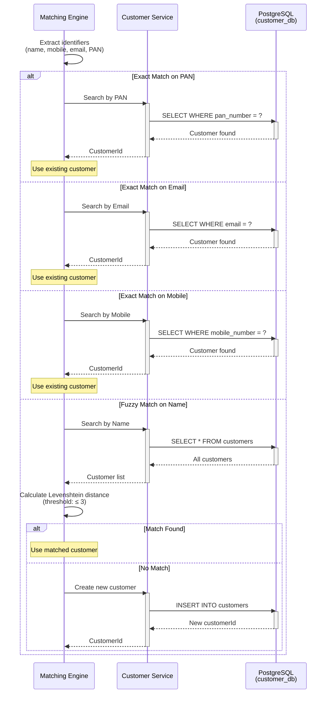

# MyPolicy System - Mermaid Sequence Diagrams

## Table of Contents
1. [User Registration Flow](#1-user-registration-flow)
2. [User Login Flow](#2-user-login-flow)
3. [Portfolio View Flow](#3-portfolio-view-flow)
4. [Coverage Insights Flow](#4-coverage-insights-flow)
5. [File Upload & Processing Flow](#5-file-upload--processing-flow)
6. [Complete End-to-End Flow](#6-complete-end-to-end-flow)

---

## 1. User Registration Flow

---

## 2. User Login Flow

---

## 3. Portfolio View Flow (Aggregation)

---

## 4. Coverage Insights Flow

---

## 5. File Upload & Processing Flow

---

## 6. Complete End-to-End Flow

---

## 7. Metadata Configuration Flow

---

## 8. Customer Matching Flow (Detailed)

---

## Usage Instructions

### To render these diagrams:

1. **GitHub/GitLab**: Paste directly in markdown files
2. **Mermaid Live Editor**: https://mermaid.live/
3. **VS Code**: Install "Markdown Preview Mermaid Support" extension
4. **Documentation Tools**: Most support Mermaid natively

### To customize:

- Change colors: `rect rgb(R, G, B)`
- Add notes: `Note over Service1,Service2: Text`
- Add loops: `loop Condition ... end`
- Add alternatives: `alt Condition ... else ... end`

---

## Key Symbols

- `→` : Synchronous request
- `-->>` : Response
- `activate/deactivate` : Service active period
- `par ... and ... end` : Parallel execution
- `alt ... else ... end` : Conditional flow
- `loop ... end` : Iteration

---

## Color Coding

- **Blue** (rgb(200, 220, 240)): Authentication & User Management
- **Green** (rgb(220, 240, 200)): File Processing & Data Transformation
- **Orange** (rgb(240, 220, 200)): Analytics & Insights

---

## Related Documentation

- [ARCHITECTURE.md](./ARCHITECTURE.md) - Complete architecture
- [API_REFERENCE.md](./bff-service/API_REFERENCE.md) - API documentation
- [SEQUENCE_COMPLIANCE.md](./SEQUENCE_COMPLIANCE.md) - Original sequence alignment
